# sprint 1
Durante a sprint tanto em parte do curso como no desafio 
foi bastante enriquecedor termos de conhecimento, pois abordaram 
tecnologias como:
* LINUX
* GIT E GITHUB
  
As quais não tinha um conhecimento aprofundado, desafios que conceberam também conhecimento, curiosidade e busca pelo o desconhecido, pois haviam coisas que não estavam no curso da sprint
o que me levou a pesquisar e ultilizar daquela ferramenta para poder concluir o desafio, além de sempre estar se comunicando no meu squad e entre outros squad pelo **Teams** o que proporcionol ajuda mútua

 diante disso posso afirmar que a sprint foi deveras importante para meu crescimento tanto como **estudante** como **futuro profissional de TI**

 ## imagens de cada passo do desafio

 1. **criando diretorio ecommerce**

 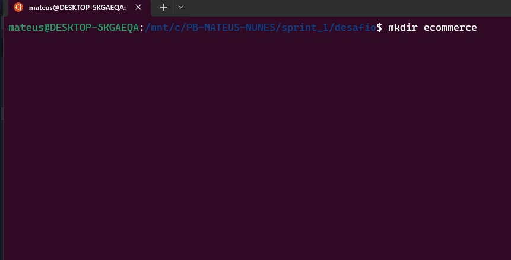

 2. **criando arquivo.sh**

 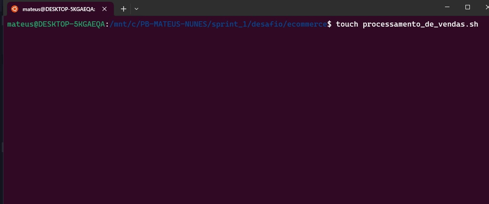

## codando arquivo.sh

 3. **configurando  arquivo.sh e seguindo os proximos passos**
       1. **guardadndo tudo em variaveis**
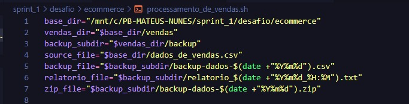 
       2. **criando diretorio vendas e backup (caso não existam) e movendo arquivo.csv para vendas**
    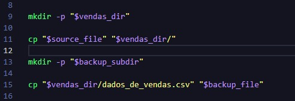
    3. **criando relatorio.txt e incluindo data, hora, primeira e ultima data de venda, e a quantidade de itens diferentes vendidos, Jexibindo e incluindo as 10 primeiras linhas**
   
   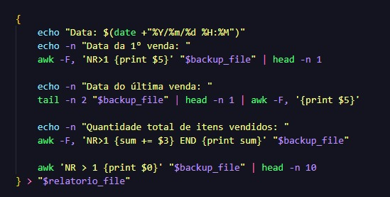

4. **compactando arquivos para .zip**
   
   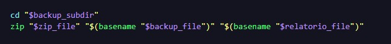

   5. **removendo arquivos .csv de backup e vendas**

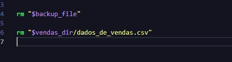

## configurando crontab
**logo em seguida temos a configuração do crontab para durante 4 dias as 15:27 o script de processamento_de_vendas.sh ser executado**
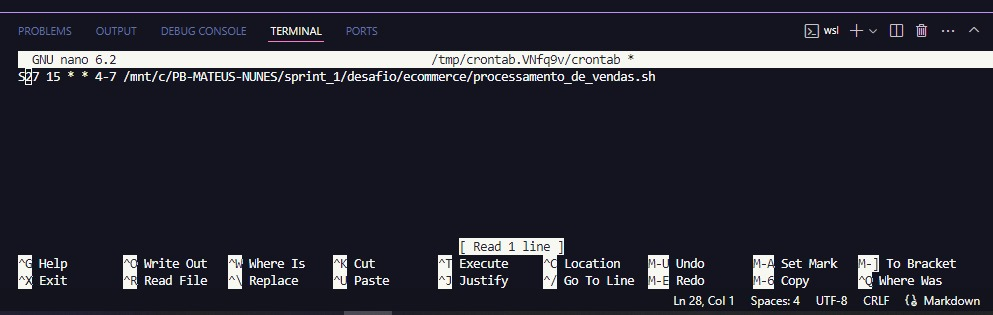

## criando consolidadr

**E em seguida criei e configurei o consolidador.sh para que criasse um relatorio_final.txt para concatenar todos os relatorios gerados durante os 4 dias**
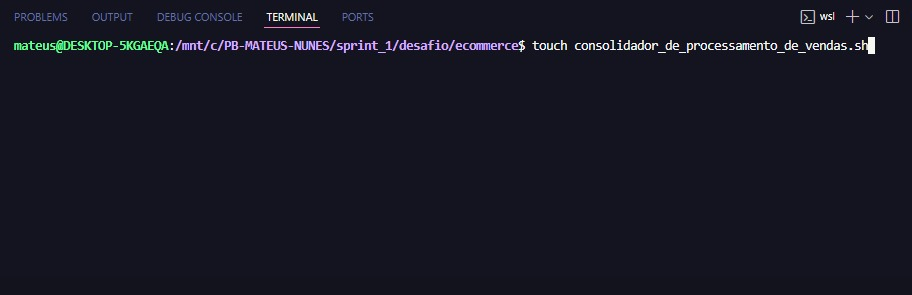

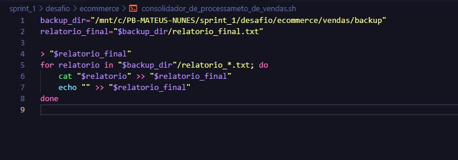

## estrutura final

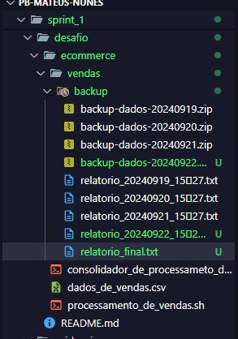