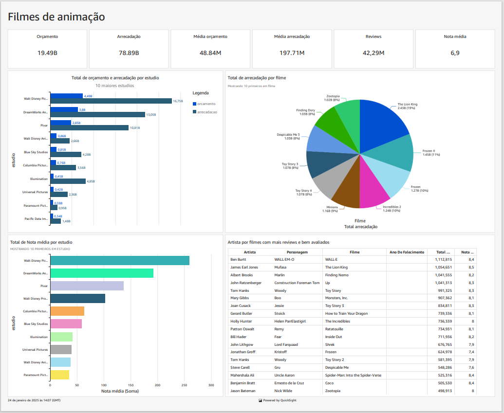

# Desafio

Antes de começar o desafio, foram feitas mudanças nas perguntas pré-definidas no início desse desafio. As perguntas que quero responder com o deshboard feito são:

- quais os estúdios que mais arrecadam com filmes de animação?

- quais os estúdios com filmes mais bem avaliados?

- quais filmes que mais arrecadaram?

- alguns atores que participaram dos filmes mais bem avaliados.

Com essas perguntas definidas, eu dei início ao desafio final, a criação do deshboard

## Preparação das consultas para fazer o deshboard

1. no console da **AWS** acessei o serviço do **quicksight**

2. na tela inicial do **quicksight** vou em "conjunto de dados" e em seguida "novo conjunto de dados"

3. seleciono o **Athena** como minha fonte de dados, em seguida escolho o **AWSData catalog** como meu cátalago de dados e o **animation-filmes** como meu banco de dados, criados anteriomente na sprint 9, nomeio como "animationDs" conecto e escolho a tabela que foi catalogada na sprint anterior pelo crawler, a "fato_filmes". Clico em "Editar/pré-visualizar dados"

4. agora que temos nossa tabela fatos filmes, vamos ter que acresentar as demais tabelas ao nosso data Sorce, para isso clico em "adicionar dados".

5. agora adicionamos as tabelas do nosso Data Source "animationDS" que faltam, nesse caso a "dim_filmes" e "dim_artista"

6. Agora estou com todas as tabelas necessárias, mas ainda não estão aparecendo os dados. Então vamos usar os joins e unir os dados. Para isso, aplico o left join para trazer os dados das dimensões para minha tabela fato através da key "Ïd_filme". E em seguida clico em "publicar e visualizar"

7. Agora posso criar  meus gráficos e fazer meu dashboard para realizar minhas análises sobre filmes de animação. Clico nas colunas e as relaciono umas com as outras com forme o que quero visualizar, escolho o gráfico que melhor combina com a análise , faço as configurações necessárias e assim crio os gráfiocos e o deshboard.

8. O resultado final do meu deshboard para analise ficou da seguinte forma 

