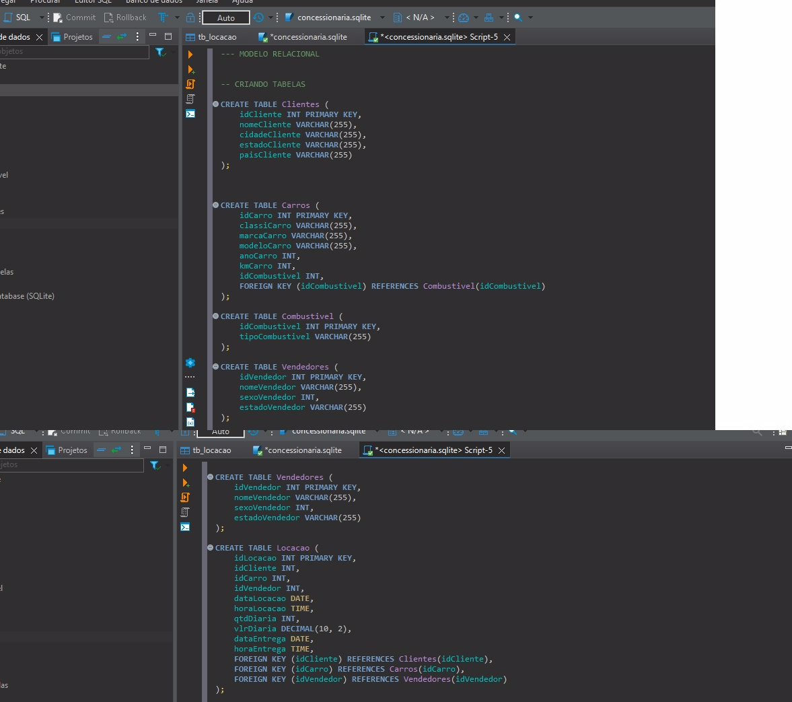
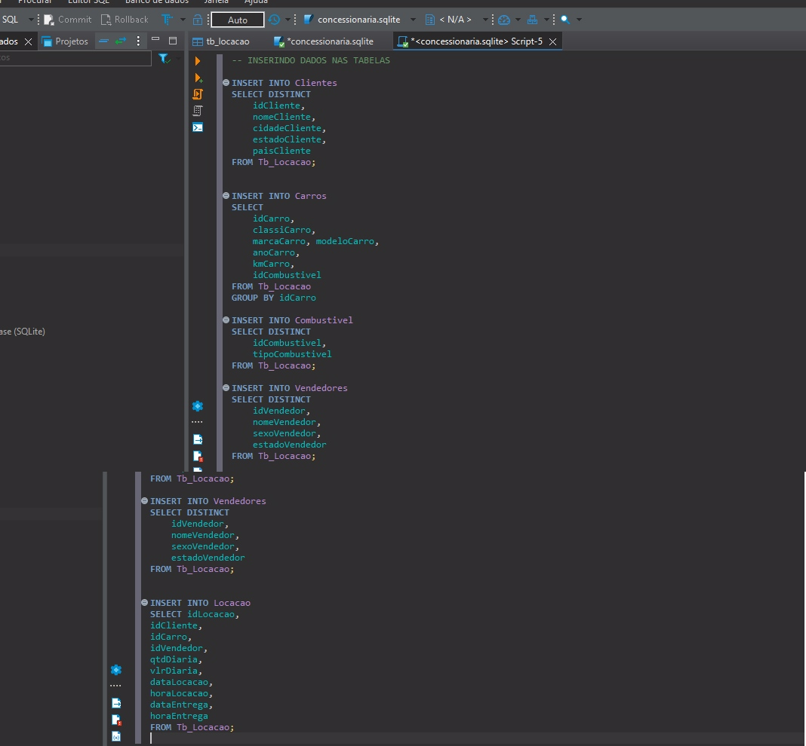
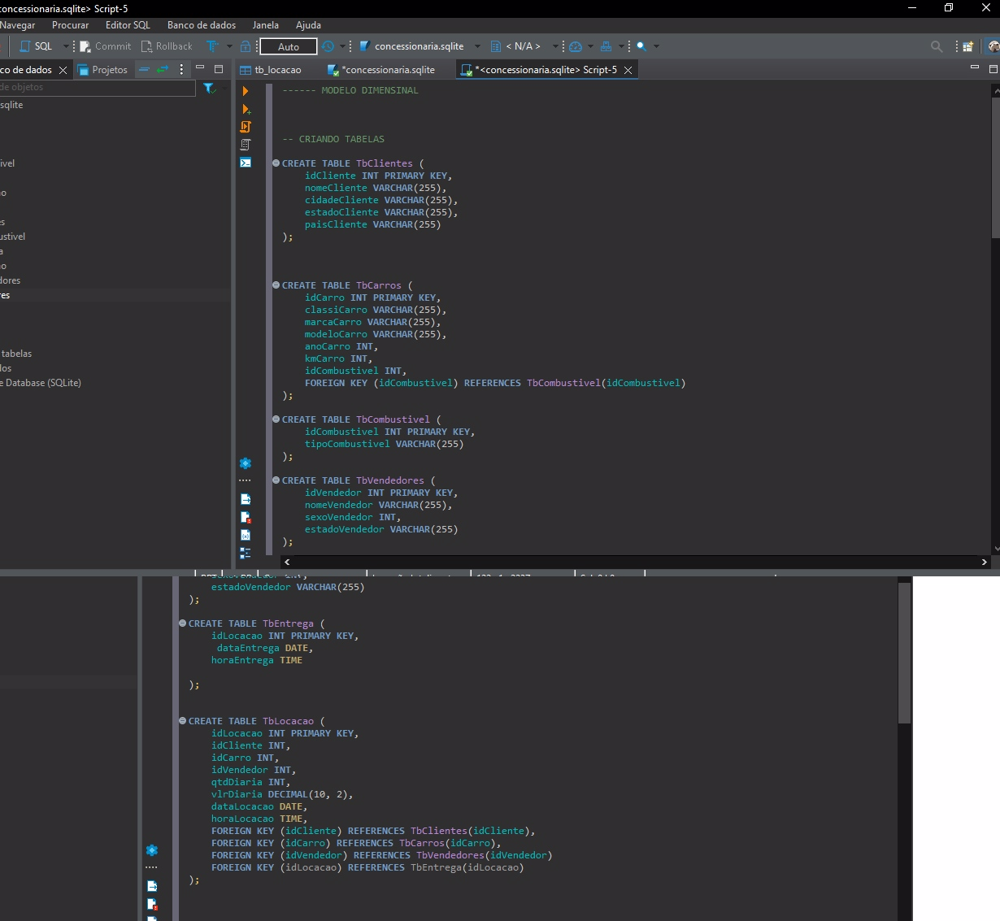
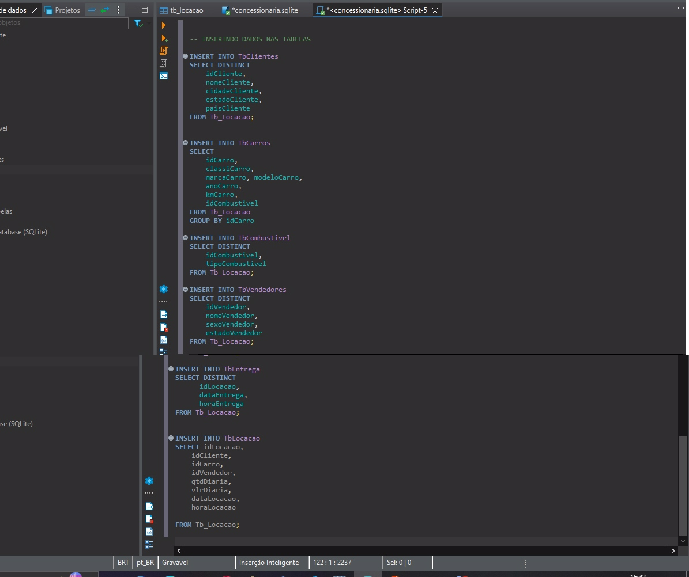
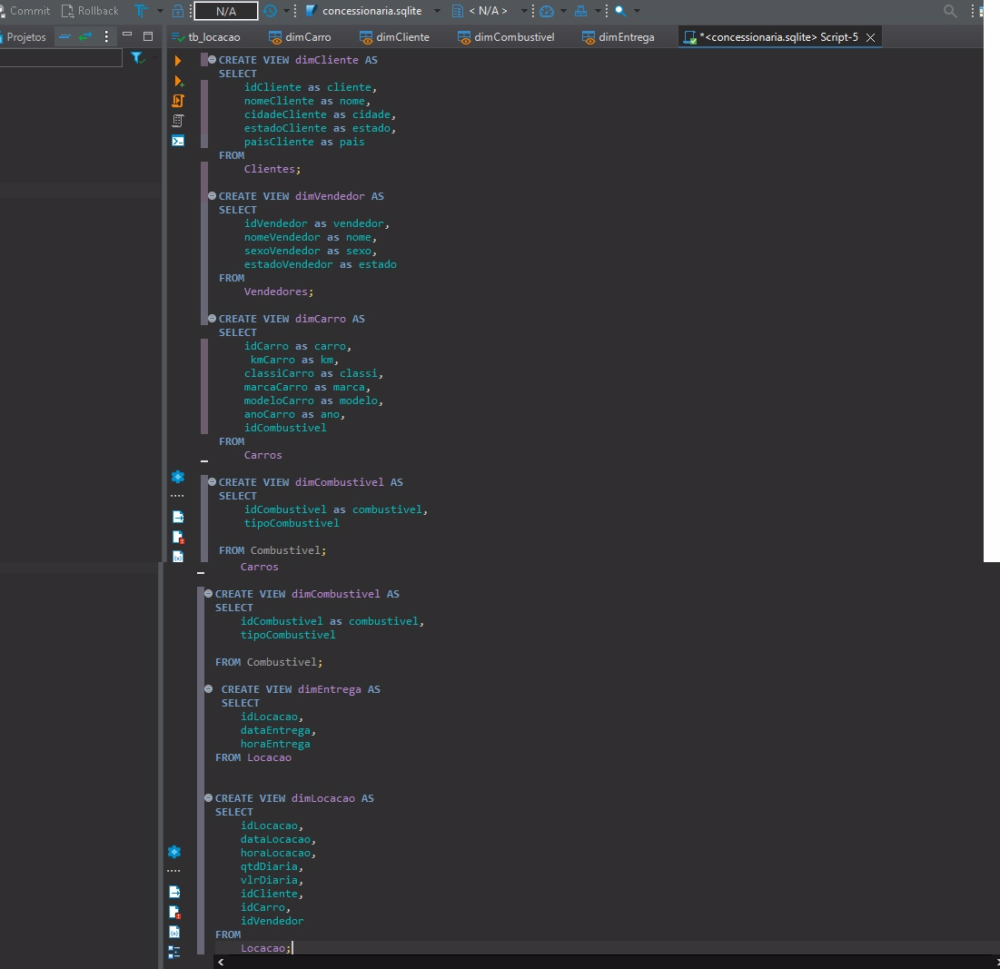

# sprint 2

Durante a sprint 2 abordaram importantes conceitos de **SQL** para a analise de dados, tais como:

- Curso de SLQ para analise de dados
- Normalização de tabelas
- Modelos relacional e dimensional
- Conceitos basicos de cloud com AWS

conceitos esses que foram de extrema importância para o aprendizado dentro de tratamento e analise de dados, gostei bastante dessa Sprint em relação a outra, pois no meu ponto de vista foi bem mais tranquilo, consegui entregar os exercicios e desafios bem adiantados, foi tudo muito bem aproveitado dentro desta sprint.
Como sempre o monitor bem atenciosos e disposto a ajudar nas duvidas, e tanto meu squad quanto o outros squads sempre ajudando uns ao outros.
Diante disso a Sprint foi deveras importante para meu crescimento e conhecimento com prossinal e estudante de TI.

# Imagem de cada passo do desafio

#### MODELO RELACIONAL

1. **normalizando e criando modelo relacional da tb_locacao**

2. **Inserindo dados nas tabelas**

#### MODELO DIMENSIONAL

1. **Criando Tabelas modelo dimensional**

2. **Inserindo dados nas tabelas**

3. **criando views para consultas**

