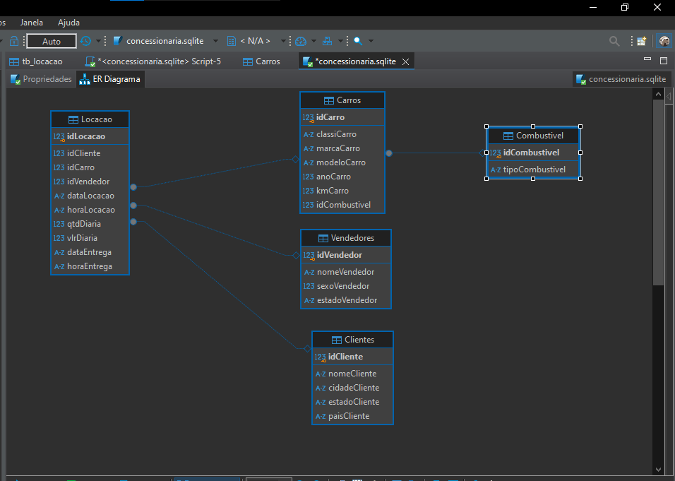

# Desafio

Para comerçar o desafio primeiramente fiz o download do concessionaria.sql disponivel 
na Udemy

Em seguida crie conexão do Sqlite no Dbeaver e exportei o arquivo para dentro dele.

Logo depois disso comecei a nomalização da tabela e criação do modelo relacional e dimensional na query

### Modelo Relacional

1. normalizando tabela e criando modelo fisico relacional.
   1. **criando tabelas**
    ````SQL 
        -- CRIANDO TABELAS
        
        -- TABELA CLIENTES

    CREATE TABLE Clientes (
         INT PRIMARY KEY,
        nomeCliente VARCHAR(255),
        cidadeCliente VARCHAR(255),
         estadoCliente VARCHAR(255),
        paisCliente VARCHAR(255)
    );

    --TABELA CARROS

    CREATE TABLE Carros (
        idCarro INT PRIMARY KEY,
        classiCarro VARCHAR(255),
         marcaCarro VARCHAR(255),
        modeloCarro VARCHAR(255),
        anoCarro INT,
        kmCarro INT,
        idCombustivel INT,
    FOREIGN KEY (idCombustivel) REFERENCES Combustivel(idCombustivel)
    );

    --TABELA COMBUSTIVEL

    CREATE TABLE Combustivel (
        idCombustivel INT PRIMARY KEY,
        tipoCombustivel VARCHAR(255)
    );

    --TABELA VENDEDORES

    CREATE TABLE Vendedores (
        idVendedor INT PRIMARY KEY,
        nomeVendedor VARCHAR(255),
        sexoVendedor INT,
        estadoVendedor VARCHAR(255)
    );
    
    --TABELA LOCAÇÃO

    CREATE TABLE Locacao (
        idLocacao INT PRIMARY KEY,
        idCliente INT,
        idCarro INT,
        idVendedor INT,
        dataLocacao DATE,
        horaLocacao TIME,
        qtdDiaria INT,
        vlrDiaria DECIMAL(10, 2),
        dataEntrega DATE,
        horaEntrega TIME,
        FOREIGN KEY (idCliente) REFERENCES Clientes(idCliente),
        FOREIGN KEY (idCarro) REFERENCES Carros(idCarro),
        FOREIGN KEY (idVendedor) REFERENCES Vendedores(idVendedor)
    );

logo depois de ter criado as tabelas eu inserir dados na mesma

2.  **Inserindo dados nas tabelas**
    ````SQL
    -- INSERINDO DADOS NAS TABELAS

    INSERT INTO Clientes 
    SELECT DISTINCT 
	    idCliente,
	    nomeCliente, 
	    cidadeCliente, 
	    estadoCliente, 
	    paisCliente
    FROM Tb_Locacao;


    INSERT INTO Carros 
    SELECT 
	    idCarro,
	    classiCarro, 
	    marcaCarro, modeloCarro, 
	    anoCarro, 
	    kmCarro,
	    idCombustivel
    FROM Tb_Locacao
    GROUP BY idCarro

    INSERT INTO Combustivel 
    SELECT DISTINCT 
	    idCombustivel, 
	    tipoCombustivel
    FROM Tb_Locacao;

    INSERT INTO Vendedores 
    SELECT DISTINCT 
	    idVendedor, 
	    nomeVendedor, 
	    sexoVendedor,
	    estadoVendedor
    FROM Tb_Locacao;


    INSERT INTO Locacao 
    SELECT idLocacao,
        idCliente, 
        idCarro, 
        idVendedor, 
        qtdDiaria,
        vlrDiaria,
        dataLocacao,
        horaLocacao,
        dataEntrega,
        horaEntrega
    FROM Tb_Locacao;


### Modelo dimensional

Em seguida fiz o modelo fisico dimensional

1. **Criando tabelas**
   `````SQL
        --CRIANDO TABELAS

        -- TBCLIENTES

     CREATE TABLE TbClientes (
        idCliente INT PRIMARY KEY,
        nomeCliente VARCHAR(255),
        cidadeCliente VARCHAR(255),
        estadoCliente VARCHAR(255),
        paisCliente VARCHAR(255)
    );

        --TBCARROS

    CREATE TABLE TbCarros (
        idCarro INT PRIMARY KEY,
        classiCarro VARCHAR(255),
        marcaCarro VARCHAR(255),
        modeloCarro VARCHAR(255),
        anoCarro INT,
        kmCarro INT,
        idCombustivel INT,
    FOREIGN KEY (idCombustivel) REFERENCES TbCombustivel(idCombustivel)
    );

        --TBCOMBUSTIVEL

    CREATE TABLE TbCombustivel (
        idCombustivel INT PRIMARY KEY,
        tipoCombustivel VARCHAR(255)
    );

    --TBVENDEDORES

    CREATE TABLE TbVendedores (
        idVendedor INT PRIMARY KEY,
        nomeVendedor VARCHAR(255),
        sexoVendedor INT,
        estadoVendedor VARCHAR(255)
    );

    --TBENTREGA

    CREATE TABLE TbEntrega (
        idLocacao INT PRIMARY KEY,
        dataEntrega DATE,
        horaEntrega TIME

    );

    --TBLOCACAO

    CREATE TABLE TbLocacao (
        idLocacao INT PRIMARY KEY,
        idCliente INT,
        idCarro INT,
        idVendedor INT,
        qtdDiaria INT,
        vlrDiaria DECIMAL(10, 2),
        dataLocacao DATE,
        horaLocacao TIME,
    FOREIGN KEY (idCliente) REFERENCES TbClientes(idCliente),
    FOREIGN KEY (idCarro) REFERENCES TbCarros(idCarro),
    FOREIGN KEY (idVendedor) REFERENCES TbVendedores(idVendedor)
    FOREIGN KEY (idLocacao) REFERENCES TbEntrega(idLocacao)
    );

    
2. **Inserindo dados nas tabelas**
    ````SQL
    -- INSERINDO DADOS NAS TABELAS

    INSERT INTO TbClientes 
    SELECT DISTINCT 
	    idCliente,
	    nomeCliente, 
	    cidadeCliente, 
	    estadoCliente, 
	    paisCliente
    FROM Tb_Locacao;


    INSERT INTO TbCarros 
    SELECT 
	    idCarro,
	    classiCarro, 
	    marcaCarro, modeloCarro, 
	    anoCarro, 
	    kmCarro,
	    idCombustivel
    FROM Tb_Locacao
    GROUP BY idCarro

    INSERT INTO TbCombustivel 
    SELECT DISTINCT 
	    idCombustivel, 
	    tipoCombustivel
    FROM Tb_Locacao;

    INSERT INTO TbVendedores 
    SELECT DISTINCT 
	    idVendedor, 
	    nomeVendedor, 
	    sexoVendedor,
	    estadoVendedor
    FROM Tb_Locacao;

    INSERT INTO TbEntrega 
    SELECT DISTINCT 
	    idLocacao,
        dataEntrega,
        horaEntrega
    FROM Tb_Locacao;


    INSERT INTO TbLocacao 
    SELECT idLocacao,
	    idCliente, 
	    idCarro, 
	    idVendedor, 
	    qtdDiaria,
	    vlrDiaria,
	    dataLocacao,
	    horaLocacao

    FROM Tb_Locacao;


### MODELOS RELACIONAL E DIMENSIONAL LOGICOS


Por fim  temos os modelos logicos gerados no Dbeaver a partir dos modelos fisicos
tanto do relacional como do dimensional

1. **modelo logico relacional**



2. **Modelo logico dimensional**
