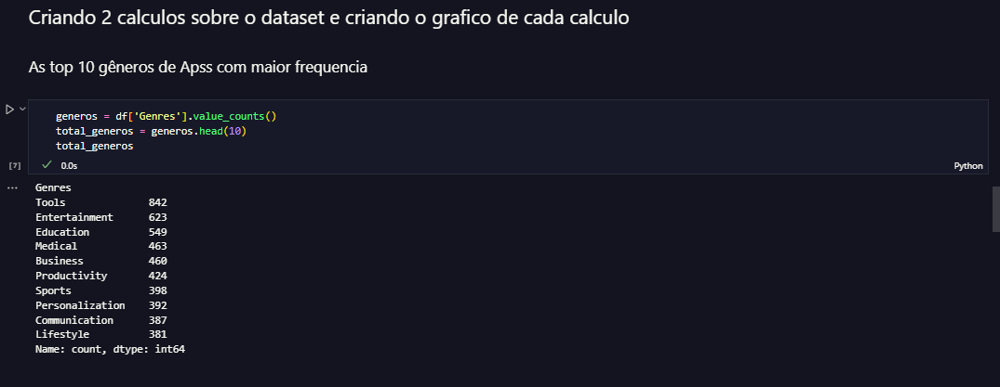
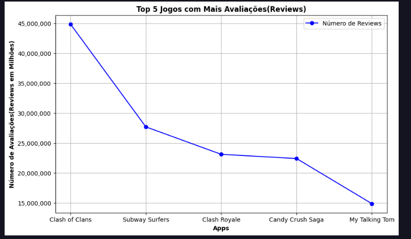

# Sprint 3

Durante a Sprint 3 foram abordados importantes conceitos da linguagem **python** onde aprendemos conceitos basicos e intermediarios 
de extrema importancia para a area de dados.
pude conhecer melhor da ferramenta **Jupyter** a qual vi que é deveras importate também no conceito da área de dados, a primeira vista foi dificil mexer na mesma pois não tinha familiaridade, porém com o tempo fui me adaptando. Além do exercicios que foram essencial para fixar os conceitos de logica de programação além funçoes de POO entre outras coias.
E o desafio abordaram também coisas as quais não vimos no curso, como as bibliotecas

- PANDAS
- MATPLOLIB

uma para manipulaçao de dados.
e a outra para criação de gráficos

diante do descrito esta sprint foi extremamente crucial em quesito de conhecimento, pois o python é um dos pincipais componentes no quesito de dados.

## links para as pastas [certificados](./certificados/) e [evidencias](./evidencias/)

# passos feitos no desafio

1. **importação de bibliotecas e remoção de linhas duplicadas**

2. **arquivo sem duplicados**

3. **criando gráfico de barras contendo os 5 app por número de instalações**

4. **Gráfico de barras**

5. **Criando gráfico de pizzas contendo as categorias de apss**

6. **Gráfico de pizza com as categorias**

7. **Mostrando o App mais caro existente no dataset**

8. **Mostrando a quantidade de apps classificados como 'Mature+17'**

9. **Mostrando os 10 apps com maior numero de rewies com seu respectivos número de rewies**

10. **Criando primeiro calculo com grafico no dataset**

11. **Criando Histograma para o calculo**

12. **Histograma**

13. **Criando segundo calculo com gráfico no dataset**

14. **Gráfico de linha**

