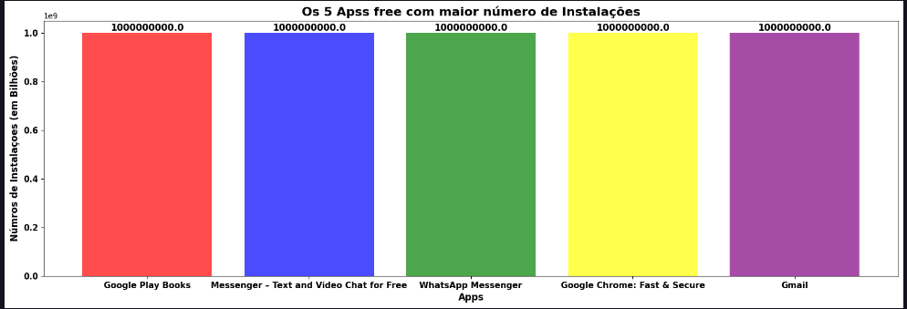
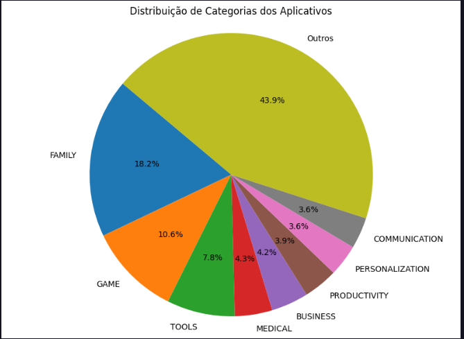
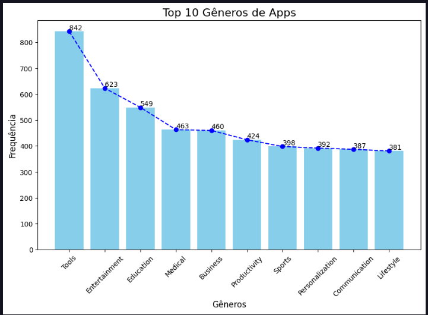

# Desafio sprint 3

Para começar o desafio fiz o download do arquivo.csv disponibilizado na udemy
e com a extensão **jupyter** no VsCode e  instalação das bibliotecas **pandas** e **matplotlib** 
Fiz:

1. **A remoção de linhas duplicadas no arquivo. csv**

    ````python
        import pandas as pd
        import matplotlib.pyplot as plt


        df = pd.read_csv('googleplaystore.csv')


        limpando_linhas_duplicadas = df.drop_duplicates()


        limpando_linhas_duplicadas

2. **A criação do gráfico de barras contendo os 5 apps mais intalados**


    ````python 
        
        df['Installs'] = df['Installs'].str.replace(',', '') 
        df['Installs'] = df['Installs'].str.replace('+', '')  


        df['Installs'] = pd.to_numeric(df['Installs'], errors='coerce') 

        top_5_instalados = df.sort_values(by=['Installs', 'Price'], ascending=False).head(5)


        cores = ['red', 'blue', 'green', 'yellow', 'purple']

        plt.figure(figsize=(20, 6))

        plt.bar(top_5_instalados['App'], top_5_instalados['Installs'], color=cores, alpha=0.7)

        plt.title('Os 5 Apss free com maior número de Instalações', fontweight='bold', fontsize=16)

        plt.ylabel('Númros de Instalaçoes (em Bilhões)', fontweight='bold', fontsize=12)
        plt.xlabel('Apps', fontweight='bold', fontsize= 12)

        for n, valor in enumerate(top_5_instalados['Installs']):
            plt.text(n, valor, str(valor), ha='center', va='bottom', fontweight='bold', fontsize=12)

        plt.xticks(fontweight='bold', fontsize=11 )
        plt.yticks(fontweight='bold', fontsize=11 )

        plt.show()

2.1. **gráfico**




3. **A a criação do gráfcio de pizzas contendo as categorias dos apps**

    ````python
        categoria = df['Category'].value_counts()
        tp_categorias = categoria.head(8)
        outros = categoria [8:].sum()

        dados_grafico = pd.concat([tp_categorias, pd.Series({'Outros': outros})])

        # Criar o gráfico de pizza

        plt.figure(figsize=(10, 7))
        plt.pie(dados_grafico, labels=dados_grafico.index, autopct='%1.1f%%', startangle=140, )
        plt.title('Distribuição de Categorias dos Aplicativos')
        plt.axis('equal')  

        plt.show()

3.1 **Gráfico**



4. **código para mostrar o app mais caro no dataset com seu respctivo valor**


5. **Código mostrando a quantidade de apps classificado como 'Mature+17'**
   


6. **Código mostrando os 10 Apps com maior numero de rewies**


7. **Criando primeiro calculo do dataset com um histograma**


7.1 **criando histograma**

        ````python
        
            plt.figure(figsize=(10, 6))
            plt.bar(total_generos.index, total_generos.values, color='skyblue')

            # Adicionar rótulos e título
            plt.xlabel('Gêneros', fontsize=12)
            plt.ylabel('Frequência', fontsize=12)
            plt.title('Top 10 Gêneros de Apps', fontsize=16)

            plt.plot(total_generos.index, total_generos.values, color='blue', marker='o', linestyle='--')

            # Mostrar os valores em cima das barras
            for index, value in enumerate(total_generos):
                plt.text(index, value, str(value), va='bottom')


            plt.xticks(rotation=45)

            plt.show()




3. **Criando segundo calculo do dataset com gráfico de linhas**


