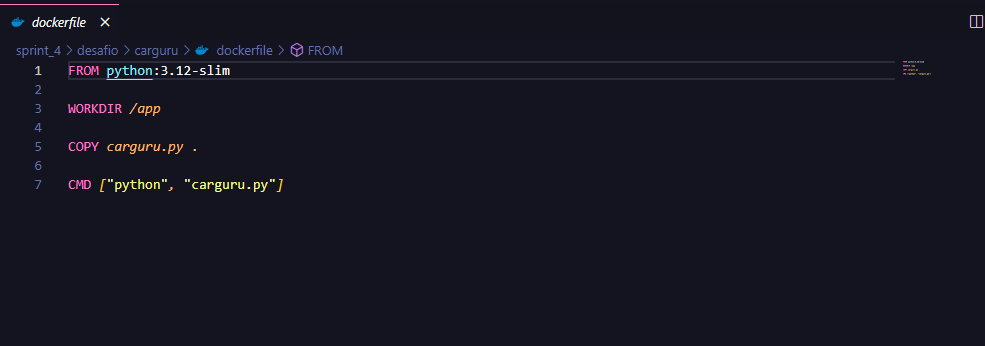
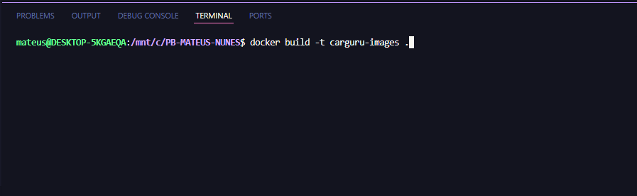
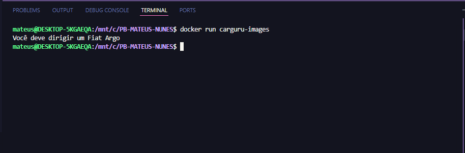
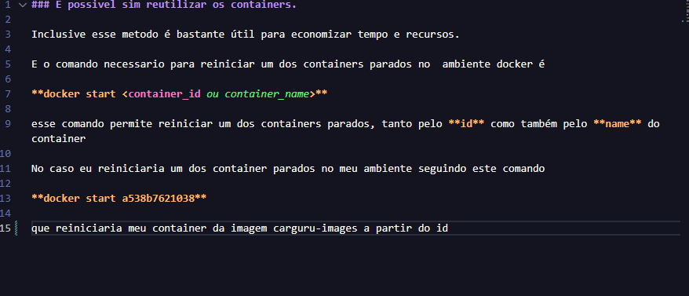
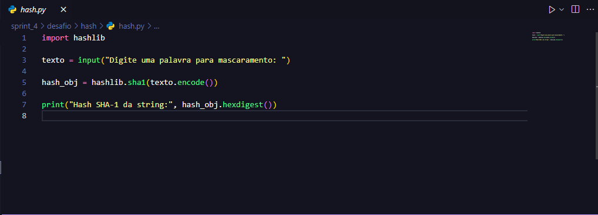
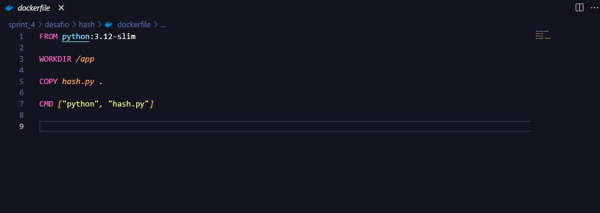
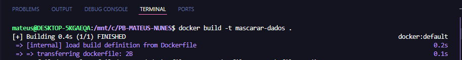
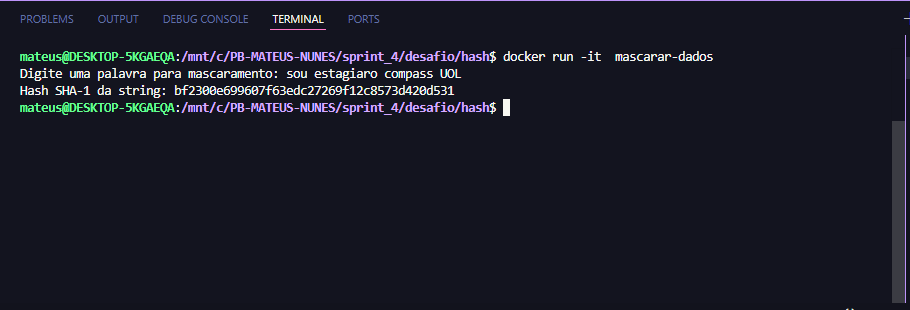

# Sprint 4
Durante a sprint foi abordados temas como
- docker
- python 
  
que foram extremamente importantes pois com isso aprendemos o processo de aplicar containers usando docker e programação funcional com python. Sobre a sprint, foi bem mais tranquila em relação as outras o desafio foi bem tranquilo de fazer com o curso de docker bem completo e avançado nem usamos tudo que aprendemos, essa sprint foi uma das melhores até o momento presente estou ansioso pelo o que ha de vir.

## links para as pastas [certificados](./certificados/) e [evidencias](./evidencias/)

# passos seguidos para fazer o desafio.

### primeira etapa, rodar script carguru.py

1. **programando arquivo dockerfile**

2. **criando imagem carguru**

3. **rodando container docker carguru**

### segunda, etapa reautilização de containers

1. **resposta sobre reutilização de containers**

### terceira etapa, script hash.py e criação de imagem e container a partir do script

1. **criando script.py para fazer mascaramento de palavras**

2. **criando arquivo dockerfile para script.py**

3. **criando imagem mascarar-dados a partir do script**

4. **criando e reodando container a partir da imagem criada**

