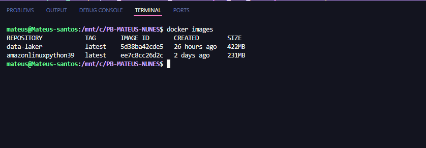

# Desafio

Para começar o desafio primeiramente baixei os arquivos **csv** fornecidos na udemy, após isso dei inicio ao desafio

### Criação do bucket

#### De inicio tive que criar o bucket dentro do serviço do s3 na **AWS** seguindo os seguintes passos:

1. dentro co console da **AWS** acessei o servido **s3**


2. dentro do **s3** cliquei em "criar bucket" 


3. Ao criar o bucket eu defino o nome como "data-lake-mateus"


4. Deixo tudo padrão, rolo até o final da página e clico em "criar bucket"


5. E com isso nosso bucket é criado.


### Arquivo dockerfile

#### com isso feito, vou para a minha IDE e configuro o arquivo dockerfile

1. crio o arquivo dockerfile, e dentro dele faço os seguintes comandos para criar imagem e rodar o container.


# Dockerfile Explicado


2. O **Dockerfile** é usado para criar a imagem Docker. Aqui está o código:

    ````dockerfile
        # 1. Usar a imagem base do Python 3.9 (versão slim)
        FROM python:3.9-slim

        # 2. Definir o diretório de trabalho dentro do contêiner
        WORKDIR /app

        # 3. Copiar o arquivo upload_s3.py para dentro do diretório de trabalho do contêiner
        COPY upload_s3.py /app/upload_s3.py

        # 4. Instalar o pacote boto3 usando pip
        RUN pip install boto3

        # 5. Criar o diretório 'data' dentro do contêiner
        RUN mkdir -p /app/data

        # Aqui, criei o diretório '/app/data' dentro do contêiner. A opção '-p' garante que, se o diretório pai não existir, ele será criado.

        # 6. Copiar a pasta 'data' para o diretório '/app/data' dentro do contêiner
        COPY data /app/data/

        # 7. Definir o comando padrão para rodar a aplicação quando o contêiner iniciar
        CMD ["python", "upload_s3.py"]


### Script python

#### Com o dockerfile feito, eu sigo para o a parte de envio dos arquivos para o bucket ultilizando o python

 1. ultilizo as blibotecas necessarias, configuro e uso minhas variaves de ambiente dentro do codigo, e as variaves de ano/mes/dia. como na imagem a baixo:


2. abaixo a explicação do códgio em detalhes
    ````python

        import boto3  # Importa a biblioteca boto3 para interagir com a AWS S3
        import os  # Importa o módulo os para acessar variáveis de ambiente
        from datetime import datetime  # Importa o módulo datetime para manipulação de data e hora

        # Cria um cliente S3 para interagir com o serviço de armazenamento na nuvem da AWS
        s3 = boto3.client(
            's3',
            aws_access_key_id=os.getenv('AWS_ACCESS_KEY_ID'),  # Obtém a chave de acesso da AWS da variável de ambiente
            aws_secret_access_key=os.getenv('AWS_SECRET_ACCESS_KEY'),  # Obtém a chave secreta da AWS da variável de ambiente
            aws_session_token=os.getenv('AWS_SESSION_TOKEN'),  # Obtém o token de sessão da AWS,

            region_name=os.getenv('AWS_DEFAULT_REGION')  # Obtém a região da AWS da variável de ambiente
        )

        # Obtém a data e hora atual do sistema
        data_processamento = datetime.now()

        # Formata a data atual para obter o ano, mês e dia
        ano = data_processamento.strftime("%Y")
        mes = data_processamento.strftime("%m")
        dia = data_processamento.strftime("%d")


abaixo consta a imagem do meu arquivo .env onde está configurado com as variaves de ambiente com minhas chaves de acesso temporarias 


3. Em seguida no meu codigo, declaro variaves que irei usar para enviar para meu bucket no s3 na raw zone, e dos meus arquivos a srem enviados, e faço o uploads dos arquivos csv locais para dentro do bucket s3, abaixo está a iamgem do codigo que faz isso:


4. abaixo a explicação do código em detalhes
    ````py

        # Definindo o caminho dentro do bucket para armazenar os arquivos de filmes e séries, com base na data (ano, mês, dia)
        raw_zone_movies = f"Raw/Local/CSV/Movies/{ano}/{mes}/{dia}"
        raw_zone_series = f"Raw/Local/CSV/Series/{ano}/{mes}/{dia}"

        # Caminho local do arquivo de filmes
        arquivo_movies = "data/movies.csv" 

        # Caminho local do arquivo de séries
        arquivo_series = "data/series.csv"  

        # Enviando o arquivo de filmes e séries para o S3 no caminho especificado
        s3.upload_file(arquivo_movies, nome_bucket, f"{raw_zone_movies}/movies.csv")
        print("Arquivo de filmes enviado com sucesso!")  # Mensagem de confirmação para o arquivo de filmes
        s3.upload_file(arquivo_series, nome_bucket, f"{raw_zone_series}/series.csv")
        print("Arquivo de séries enviado com sucesso!")  # Mensagem de confirmação para o arquivo de séries

5. na estrutura do diretorio os arquivos estão dentro de uma pasta chamada "data", como mostra a imagem:


### Execução do desafio

#### Com tudo isso já configurado e feito, fazemos a execução do desafio

1. primeiro criamos a imagem docker com o comando **docker build -t nome da imagem .** , como na imagem abaixo.


com o comando **docker images**, vemos que a imagem foi criada.



2. Em seguida damos o comando **docker run** pra rodar nosso container e com a tag **-v** criamos nosso volume que faz a copia dos arquivos csv para dentro dele, e depois de um tempo me retorna o print do nosso script python, confirmando o envio dos arquivos para a raw zone do bucket.


3. Com isso nossa raw zone com o caminho especificado no script e com os arquivos são enviados para o bucket.


4. em seguida navegamos até ver se realmente os arquivos estão dentro do bucket.


### Verificando se volume esta criado e com os arquivos csv

#### Já que vimos que os arquivos estão dentro do nosso bucket agora iremos ver se o volume foi criado e esta com os arquivos também

1. primeiro usamos o comando **docker volume ls** para listar o volume criado anteriomente


2. e para ver se os arquivos estavam dentro do meu volume abri o docker desktop  mesmo e verifiquei la dentro se os arquivos constavam dentro do meu volume


# Observação

#### 1. como o arquivo "movies.csv" ultrapassava o limite que o githhub suporta, foi falado pelo julio em um dayli que poderia apagar para evitar este erro, diante disso dentro do diretorio data encontra-se apenas o arquivo "series.csv" 


