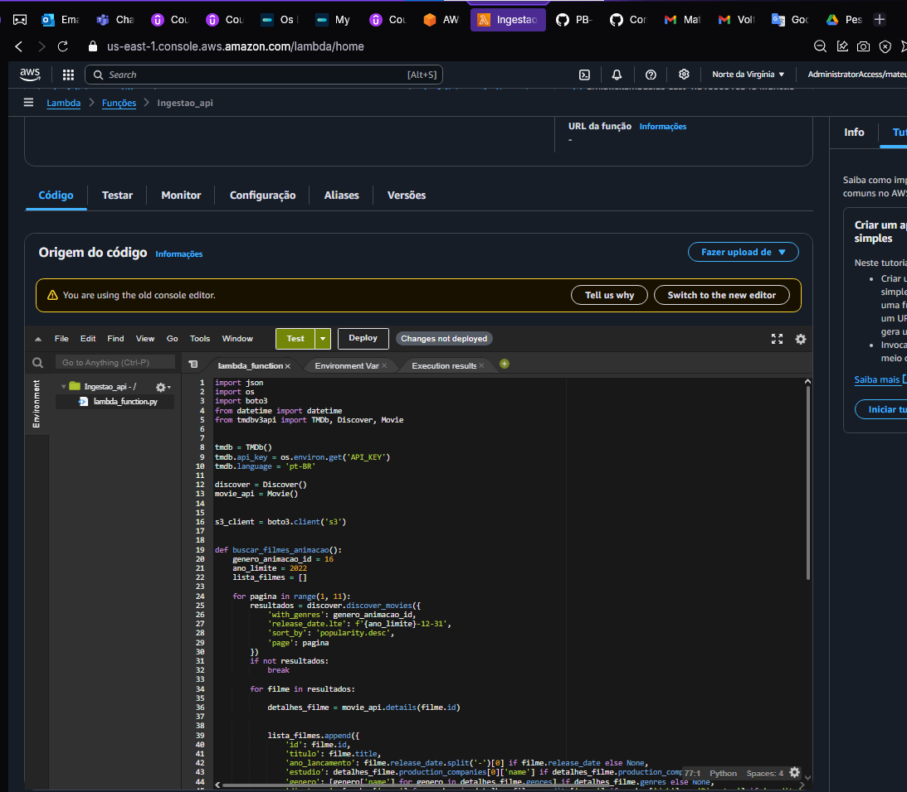

# Desafio
Para a resolução para esse deafio primeiro preparei as perguntas as quais queria responder, minhas perguntas irão ser voltadas para filmes do gênero animação, as quais as pereguntas serão as seguintes: quais são os studios com as melhores animação?
quais os melhores diretores com os melhores filmes?
quais os atores mais requisitados para os elencos dos filmes em geral?

Com as perguntas as quais quero responder eu fiz minhas requisições na API para complementar os dados jà exitentes

# passo a passo seguido para desenvolvimento do desafio

com as perguntas as quais eu queira responder já preparadas eu dei continuidade ao desafio

OBS 1: ja tinha criado uma função antes, porém irei mostar eu criando uma função do 0 e depois eu irei testar a que ja estava criada

OBS 2: nossa função já esta com a politica de acessFull ao s3, e as variaves de ambiente, key da API, foi definida dentro do lambda, usamos apenas a lib os para interagir ao nosso codigo, e o tempo de execução foi de 2 min, com uma memoria de 512 MB

## criando função lambda e adicionando a layer necessaria

1. Dentro do consele da AWS, eu acessei o serviço do lambda.


2. Dentro do serviço do lambda, cliquei em criar função para criar minha função lambda


3. Com a aba de criar função aberta, eu comecei a criar a função, foi dada o nome de **"ingestao_api"**, a qual ultilizei com tempo de execução o **python 3.12** e a arquitetrura como **"x84_64"**, como na imagem abaixo:


4. depois clico em criar função e com isso minhaa função lambda é criada


## Criando layer para a função

### com a função lambda criada agora vamos criar uma layer e atribuir a ela

1. dentro do **VScode** com o terminal do **WSL** eu primeiro crio o diretorio **lamda_layer**


2. Navego até o diretorio criado e logo em seguida crio o diretorio **python** onde ira ficar minhas dependencias para a layer.


3. Com os diretorio criados, agora vamos instalar as dependencias, no caso a lib tmdbv3api, para dentro do diretorio python.


4. Logo após a instalação da lib para o diretorio, agoras vamos compactar para .zip para colocarmos dentro da layer


5. Com isso feito, voltamos ao console da AWS e dentro do serviço de lambda vamos em "criar camada", para criar a layer e adicionar o arquivo.zip que criamos no passo anterior.


6. com isso damos o nome da layer como "ingestao-api" com arquitetura x86_64, com o tempo de execução "python 3.12" fazemos o uploado do arquivo.zip e cicamos em criar camada.


## Teste lambda

com a nossa layer criada, agora vamos ao teste da nossa função lambda.

dentro da função lambda foiu feito os seguintes passo

1. agora dentro da função clicamos e layer e vamos adicionar a layer criada anteriormente


2. escolhemos a opção "camada perdsonalizada" e escolhemos layer criada, logo em seguida clicamos em "adicionar", com isso nossa layer e adicionada a nossa função.


3. antes de dar continuidade, vamos ate o S3 para ver se realmente não temos dentro do nosso bucket o caminho até o arquivo Json


4. Como visto dentro do s3 não há caminho dentro do bucket até o Json, agora vamos até a função lambda e com o codigo dentro da nossa função, ao final darei mais explicação sobre o código, demos o deploy e criamos um evento de teste



5. Os logs mostram que o a a função lambfa foi executada com sucesso


6. Em seguida dentro do nosso bucket navegamos até o S3 para vereficarmos se realemnte foi bem executado.


### Como visto a execução da nossa função foi um sucesso

## Codigo ultilizado dentro da nossa função

### agora vou da mais explicação sobre o código que foi adicionado dentro da nossa função lambda

1. a baixo a estruta do código


### explicação do codigo: 

## Estrutura do Código

### Importação de Bibliotecas
```python
import json
import os
import boto3
from datetime import datetime
from tmdbv3api import TMDb, Discover, Movie

# Configuração da API TMDb

tmdb = TMDb()
tmdb.api_key = os.environ.get('API_KEY') 
tmdb.language = 'pt-BR'  
discover = Discover()
movie_api = Movie()


# Configuração do Cliente S3

s3_client = boto3.client('s3') # Configura o cliente S3 para enviar arquivos ao bucket especificado.


# Função buscar_filmes_animacao

def buscar_filmes_animacao():
    genero_animacao_id = 16
    ano_limite = 2022
    lista_filmes = []

    for pagina in range(1, 11):  
        resultados = discover.discover_movies({
            'with_genres': genero_animacao_id,
            'release_date.lte': f'{ano_limite}-12-31',
            'sort_by': 'popularity.desc',
            'page': pagina
        })
        if not resultados:
            break

        for filme in resultados:
            detalhes_filme = movie_api.details(filme.id)
            lista_filmes.append({
                'id': filme.id,
                'titulo': filme.title,
                'ano_lancamento': filme.release_date.split('-')[0] if filme.release_date else None,
                'estudio': detalhes_filme.production_companies[0]['name'] if detalhes_filme.production_companies else None,
                'genero': [genero['name'] for genero in detalhes_filme.genres] if detalhes_filme.genres else None,
                'diretores': [membro['name'] for membro in detalhes_filme.credits['crew'] if membro['job'] == 'Director'] if 'credits' in detalhes_filme and 'crew' in detalhes_filme.credits else None,
                'orcamento': detalhes_filme.budget,
                'arrecadacao': detalhes_filme.revenue
            })
    return lista_filmes

#Descrição da função
# 1. Busca filmes do gênero animação (genero_animacao_id = 16) lançados até 2022.
# 2.tera pelas primeiras 10 páginas de resultados da API TMDb.
# 3. Para cada filme, coleta detalhes adicionais (estúdio, gêneros, diretores, orçamento, arrecadação).
# 4. Retorna uma lista de dicionários contendo as informações dos filmes.


# Função salvar_no_s3

def salvar_no_s3(dados, bucket_name):
    try:
        tamanho_chunk = 100 
        contador_arquivo = 0
        data_atual = datetime.now()
        caminho_base = f"Raw/TMDB/JSON/{data_atual.year}/{data_atual.month:02}/{data_atual.day:02}/"

        for i in range(0, len(dados), tamanho_chunk):
            chunk = dados[i:i + tamanho_chunk]
            nome_arquivo = f"file_{contador_arquivo}.json"
            caminho_completo = f"{caminho_base}{nome_arquivo}"

            json_data = json.dumps(chunk, ensure_ascii=False, indent=4)
            s3_client.put_object(Bucket=bucket_name, Key=caminho_completo, Body=json_data, ContentType='application/json')

            print(f"Dados salvos com sucesso no S3: {caminho_completo}")
            contador_arquivo += 1

    except Exception as e:
        print(f"Erro ao salvar os dados no S3: {e}")


#Descriçãoda função
# 1. Divide os dados em chunks de 100 registros.
# 2. Salva cada chunk como um arquivo JSON no bucket S3.
# 3. O caminho de salvamento inclui a data atual (Raw/TMDB/JSON/YYYY/MM/DD/).
# 4.Exibe mensagens de sucesso ou erro no processo de salvamento.


# Função Principal: lambda_handler

def lambda_handler(event, context):
    bucket_name = "data-lake-mateus"  
    filmes = buscar_filmes_animacao()
    if filmes:
        salvar_no_s3(filmes, bucket_name)
    return {
        'statusCode': 200,
        'body': json.dumps('Processamento concluído com sucesso!')
    }


# Descrição da função
# 1. Nome do bucket S3: "data-lake-mateus".
# 2. Chama as funções buscar_filmes_animacao e salvar_no_s3.
# 3. Retorna um status HTTP 200 indicando sucesso no processamento.