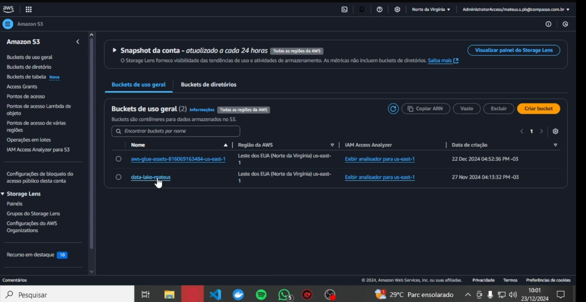
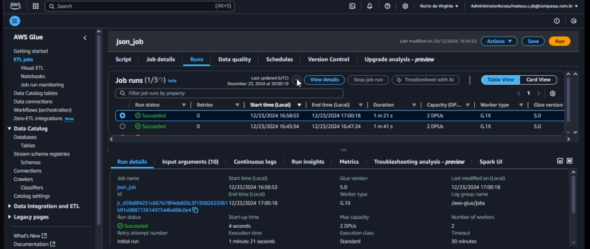

# Desafio

para executar o desafio pruimeiros vamos comentar sobre como foi feito dentro da aws com o glue e o S3 e em seguida iremos ver como funciona o código usado dentro do jobs do glues, tanto para processar os dados csv como os json.

## Criando jobs

### job para os arquivos csv

para iniciar, dentro do console do aws acessamos o aws glue e fizemos os jobs para limpeza dos dados

1. dentro do glue studio clicamos em script editor, e em seguida clicamos em create script escolhendo spark, como na imagem a baixo:


2. em seguida vamos em 'job details' e configuramos os detalhes do job como descritos na Udemy ultilizando python como linguagem para ultilizar o spark


3. na aba de 'script' copio e colo o script previamente desenvolvido localmente no VScode.


4. antes de rodarmos o job vamos até o s3 para verificar que ainda nao temos a trusted zone dentro do bucket.


5. como vimos na etapa anterior nao temos a trusted zone, agora vamos salvar e rodar nosso script dentro do job o qual fara a limpeza dos dados e salvara dentro do s3 no caminho da trusted zone.


6. com nosso job rodou com sucesso, agora navegaremos até o s3 para verificar se está tudo ok.





### job para os arquivos json

como vimos nosso job para os aquivos csv foram um sucesso!
agora iremos criar um outro job para processar os arquivos json, os mesmo processos e configuracoes foram feitos igual ao job anterior, com isso vou mostrar apenas a parte do script em diante.

1. com o job ja criado e configurado, copiei e colei o script previamnete feito localmente no VS code, e coloquei dentro do job para rodar.


2. ja com o script dentro do job, salvamos e rodamos o script



3. vimos que o script roudou com sucesso, vimos também no passo anteriormente so tinhamos a caminho para os aqruivos csv, entao vamos navegar até o bucket para ver se deu certo.


 


## catalogando dados de filmes com glue crawler.

### Bom vimos que nosso jobs foram um sucesso, agora vamos usar o glue crawler para catalogar os dados? bom, vamos lá.

1. dentro do aws glue, vamos em crawler e damos uma nome para o crawler, e apertamos em next.


2. depois, vamos adcionar o caminho dos dados dentro do s3 que queremos catalogar, nesse caso o caminho dos antigos csv que agora sao parquet


3. depois de adiciopnar os dados que vamso catalogar, agora iremos colocar um role, como ja havia uma criada do exercicio, decidi usar ela para dar acesso ao nosso s3, e apertamnos em next.


4. em seguida, escolhemos uma database previamente criado, e  apertamos em next.


5. revisamos tudo, e clicamos em creat crawler


6. com nosso crawler criado rodamos o mesmo.


7. como vimos o crawler foi um sucesso, com isso navegamod ate a aba de tabelas oara ver se os dados realmente foram catalogados


8. esse foi o primeiro crawler para os antigos arquivos csv, agora vamos criar outro para os antigos json. foram usados as mesmas configuracoes e o mesmo database para catalogar os dados, apenas mudamos os nomes, diante disso rodamos o crawler e vnavegamos para ver se realmente foram catalogados

 


como vistos os dois crawler foram um sucesso, agora vamos ver o que cada script faz

## explicando os scripts usados 

1. script job csv

    ````python
    


