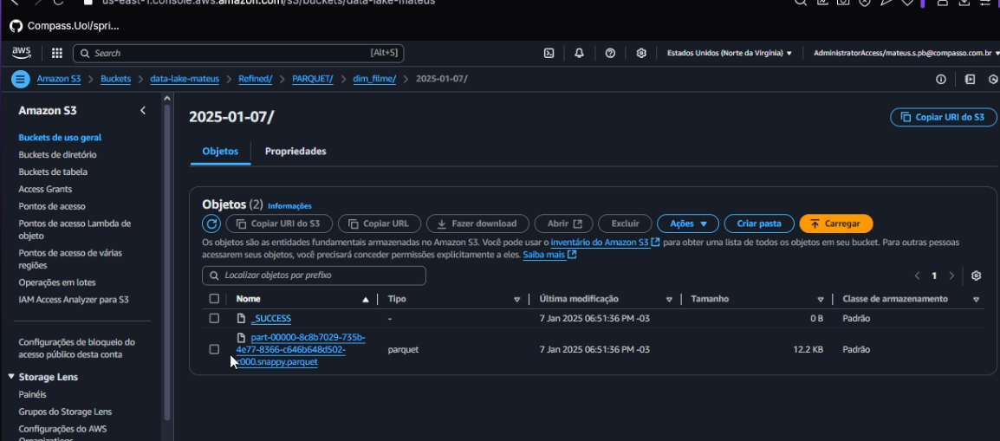

# Desafio

Antes de iniciar o desafio foram feitos algumas alterações no projeto em geral, as alterações foram:

- Foi feito um ajuste no código do Lambda, pois os dados que foram ingeridos estavam em português, o que não daria certos, pois os dados do CSV estavam em inglês, isso estava dando erro ao executar meu código, pois os dados não davam match.

- Foi feito alterações também no código do job do CSV, pois não havia explodido as colunas de gêneros isso também afetou na hora de executar o desafio, pois os dados mostravam outros gêneros na hora de dar match na coluna gêneros, então tive que voltar e ajustar para explodir a coluna de gênero o que me possibilitou pegar apenas o gênero que estou fazendo a análise

### Feito isso dei andamento ao desafio

Primeiro explicarei o que foi feito dentro do console da AWS, e em seguida explicarei o código usado para o job do glue

## Criando e executando Job

1. Para verificarmos que não temos nada dentro do bucket, navegamos até o serviço do s3 para verificar que não há nenhuma camada Refined


como visto não há uma camada refined criada, vamos cria-lá no próximo passo

2. agora acesso o AWS glue e usar o job para fazer nossa modelagem multidimensional


3. clico em "Script editor" e escolho Spark para fazer a modelagem


Com isso nosso job é criado, agora vamos ajusta-lo!

4. dentro do job na parte de Script vamos copiar e colar o codigo que foi desenvolvido e ajustado localmete, no final explicarei o código!


5. agora ajusto as Configurações do job como descrito e orientado na udemy


5. agora clicamos em "save" e "Run" para salver o rodar o job


6. com isso nosso job é executado com sucesso.


7. Agora para ver se realmente deu certo, vamos até o nosso bucket no S3 e verificar se a camada foi criada juntos as nossas tabelas.


8. nossa camad foi criada com o job, agora vamos verificar se nossas tabelas foram salvas, para isso navegaremos pelo caminho até os quivos.





\

com isso nossas tabelas foram criadas e salvas dentro da camada Refined com sucesso!

## catalogando dados 

com isso feito agora vamos catalogar nossos dados com crawler do glue para deixar eles disponíveis para consultas no AWS Athena

1.  já dentro do glue na aba do crawler vamos clicar em **"create crawler"**


2. com isso feito agora nomeio como "refined_crawler" e clico em "next"


3. agora adicionaremos o caminho da nossa camada Refined para ele catalogar os arquivos das tabelas, em seguida clico em "next"


4. adicionamos a política para ter acesso aos arquivos do S3, foi reutilizada a que foi feito em exercicios passado.


5. agora adicionaremos um data base previamente criado com o nome de "animation-movies" e em seguida clico em "Next"


6. com isso verificamos as confgiguracoes e clicamos em "create Crawler" e com isso noss crawler é criado


7. agora clico no crawler criado anteriormente e executo o mesmo, e depois de um tempo ele é executado com sucesso!


8. agora verificaremos se os dados foram catalogados e salvos no nosso data base


com isso todos os nossos dados foram catalogados e  estão acessíveis para consultas no AWS athena!!

## Código explicado

agora vou explicar o código ultilizado dentro do job em detalhes

1. codigo ultilizado para modelagem multidimensional

    ````python

    import sys
    from awsglue.transforms import *
    from awsglue.utils import getResolvedOptions
    from pyspark.context import SparkContext
    from awsglue.context import GlueContext
    from awsglue.job import Job
    from pyspark.sql.functions import coalesce
    from datetime import datetime

    args = getResolvedOptions(sys.argv, ['JOB_NAME'])

    # Inicializa o SparkContext e o GlueContext
    sc = SparkContext()
    glueContext = GlueContext(sc)
    spark = glueContext.spark_session

    # Configura o job no AWS Glue
    job = Job(glueContext)
    job.init(args['JOB_NAME'], args)

    # Obtém a data atual no formato 'YYYY-MM-DD' para colocar no caminho do S3
    current_date = datetime.now().strftime('%Y-%m-%d')

    # Define os caminhos para as dimensões e tabela fato serem salvos corretamente dentro do nosso bucket no S3, se nao existe o job ira cria-lá 
    dim_filme_path = f"s3://data-lake-mateus/Refined/PARQUET/dim_filme/{current_date}/"
    dim_artista_path = f"s3://data-lake-mateus/Refined/PARQUET/dim_artista/{current_date}/"
    fato_filme_path = f"s3://data-lake-mateus/Refined/PARQUET/fato_filme/{current_date}/"

    # Lê os dados do TMDB e Local no formato Parquet diretamente do bucket S3
    df_tmdb = spark.read.option("header", "true").parquet("s3://data-lake-mateus/Trusted/TMDB/PARQUET/2025-01-07/")
    df_imdb = spark.read.option("header", "true").parquet("s3://data-lake-mateus/Trusted/Local/PARQUET/Movies/2025-01-05/")

    # Realiza o join entre os dois datasets com base no título e ano de lançamento, usei o right join pois foi o mais apropriado para a minha analise final
    tabelao = df_imdb.join(
        df_tmdb, 
        (df_imdb.tituloOriginal == df_tmdb.titulo) & 
        (df_imdb.anoLancamento == df_tmdb.ano_lancamento), 
        "right_outer"
    )

    # Crio uma especie de "tabelao"  para facilictar na hora de "desmebrar" as tabelas, seleciono e unifico colunas que vou usar na analise , utilizando `coalesce` nas colunas que tem em comum nos dois datasets para priorizar valores não nulos, ultilizo também o "alias()" para renomear as colunas
    tabelao_unificado = tabelao.select(
        coalesce(df_imdb["id"], df_tmdb["id"]).alias("id_filme"),
        coalesce(df_imdb["tituloOriginal"], df_tmdb["titulo"]).alias("tituloFilme"),
        coalesce(df_imdb["anoLancamento"], df_tmdb["ano_lancamento"]).alias("anoDeLancamento"),
        coalesce(df_imdb["genero"], df_tmdb["genero_nome"]).alias("generoFilme"),
        df_imdb["notaMedia"],
        df_imdb["numeroVotos"],
        df_imdb["generoArtista"],
        df_imdb["nomeArtista"],
        df_imdb["personagem"],
        df_imdb["anoNascimento"],
        df_imdb["anoFalecimento"],
        df_tmdb["estudio"],
        df_tmdb["orcamento"],
        df_tmdb["arrecadacao"]
    )

    # Filtro apenas filmes do gênero "Animation" e remove duplicatas com base no título e ano de lançamento
    tabelao_final = tabelao_unificado.filter(tabelao_unificado["generoFilme"].contains("Animation"))
    tabelao_final = tabelao_final.dropDuplicates(["tituloFilme", "anoDeLancamento"])

    # Crio as dimensoes e a tabela fato com informações básicas sobre o que vai ser usando dentro de cada uma e gravo no caminho especificado anteriomente para salvar na camada refined no S3

    # Dimensão filme
    dim_filme = tabelao_final.select(
        "id_filme", "tituloFilme", "generoFilme", "estudio"
    ).distinct()

    dim_filme.write.mode("overwrite").parquet(dim_filme_path)

    # Dimensão artista
    dim_artista = tabelao_final.select(
    "id_filme", "nomeArtista", "personagem", "generoArtista", "anoNascimento", "anoFalecimento"
    ).distinct()

    dim_artista.write.mode("overwrite").parquet(dim_artista_path)

    # tabela fato
    tabela_fato = tabelao_final.select(
        "id_filme", "anoDeLancamento", "notaMedia", "numeroVotos", "orcamento", "arrecadacao"
    ).distinct()

    tabela_fato.write.mode("overwrite").parquet(fato_filme_path)

    # como visto foi ultilizado o "id_filme" tanto como PK como FK para relacionar as tabelas

    # Finaliza o job do AWS Glue
    job.commit()


2. com isso meu modelo multidimensional ficou dessa forma:


